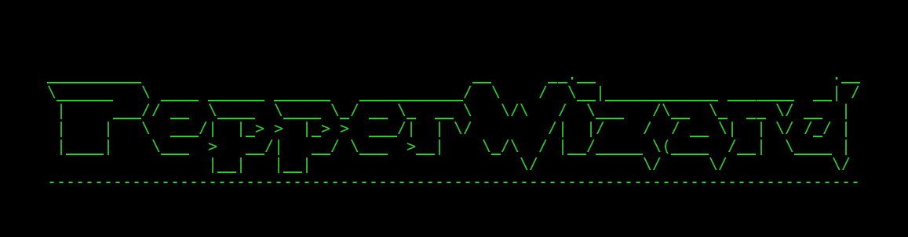

# PepperWizard

PepperWizard is a Python 3 command-line application for teleoperating the SoftBank Pepper robot. It provides an interactive TUI for voice interaction, teleop, and scripted behaviours, backed by a Dockerised NAOqi bridge.

## Features

*   **Modern Bridge Architecture:** Integrates with `PepperBox` to wrap the legacy Python 2.7 / NAOqi SDK in a Docker container, so your code stays in Python 3.
*   **Self-contained MVP:** Three-service compose runs on any Linux + Docker host that can reach the robot on the network. Optional services (joystick, vision tracking, proprioception) live in a developer overlay.
*   **Talk Modes:** A unified interface for speech and animation, with **push-to-talk voice input** (CPU Whisper), **slash-command autocomplete**, **spellcheck**, and **emoticon animation triggers**.
*   **Teleop:** Keyboard by default; joystick (DualShock via [Dualshock-ZMQ](https://github.com/Action-Prediction-Lab/Dualshock-ZMQ)) when the dev overlay is enabled.
*   **Experimental Logging:** Timestamped JSONL logging of all interactions.
*   **Social State Control:** Toggle the robot's autonomous social behaviours.
*   **Battery & Temperature Status:** Battery level and joint-temperature warnings polled every 10s.

## Architecture

The default `docker-compose.yml` is a **self-contained MVP** — three services, no other repos required:

1.  **`pepper-robot-env`**: Python 2.7 "shim server" bridging the robot's NAOqi OS to modern Python 3 callers over HTTP `:5000`.
2.  **`stt-service`**: Whisper CPU speech-to-text. Captures audio from the host microphone; communicates over ZeroMQ.
3.  **`pepper-wizard`**: The Python 3 CLI in this repo. Drives the robot through the shim and orchestrates optional autonomous features (tracking, perception) when they're available.

A separate `docker-compose.dev.yml` overlay adds `dualshock-publisher` (joystick teleop), `perception-service` (YOLO/mediapipe vision), and `proprioception-service` (state publishing). These require sibling checkouts of [`PepperBox`](https://github.com/Action-Prediction-Lab/PepperBox) and [`PepperPerception`](https://github.com/Action-Prediction-Lab/PepperPerception) and are aimed at developers.

The `pepper-wizard` application itself is structured as follows:

*   `main.py`: The main application entry point.
*   `robot_client.py`: A client class that handles all direct communication with the robot.
*   `teleop.py` / `keyboard_teleop.py`: Joystick and keyboard teleop threads.
*   `command_handler.py`: Maps user commands to specific actions.
*   `cli.py`: Handles all command-line interface (UI) elements.
*   `config.py`: Loads configuration files.

## Getting Started

### Prerequisites

*   Linux host
*   Docker + Docker Compose
*   A Pepper robot reachable on your network (or a NAOqi simulator)

> **OS Compatibility**: PepperWizard uses `network_mode: host` and host PulseAudio for the microphone, so it currently requires **Linux**. macOS and Windows are on the long-term roadmap but are not supported for the MVP.

> The NAOqi bridge runs from the public `jwgcurrie/pepper-box` image — Docker pulls it automatically on first run.

### 1. Point PepperWizard at your robot

The connection is configured via a `robot.env` file. Copy the example and edit if your robot isn't at the lab default:

```bash
cp robot.env.example robot.env
```

```bash
# robot.env
NAOQI_IP=192.168.123.50   # robot IP (use 127.0.0.1 for a local NAOqi sim)
NAOQI_PORT=9559           # 9559 on physical robots, sim-specific otherwise
```

### 2. Build and run (MVP)

```bash
docker compose up -d --build          # start shim + STT in the background
docker compose run --rm -it pepper-wizard   # launch the interactive CLI
```

That's the whole path. Teleop defaults to **Keyboard** mode; tracking entries are hidden if the optional services aren't running.

### 3. Developer stack (optional)

The developer overlay (`docker-compose.dev.yml`) adds joystick teleop, proprioception, optional GPU vision tracking, and swaps the physical-robot shim for the **qiBullet simulator** baked into `pepper-box:latest`. It requires a sibling checkout of [`PepperBox`](https://github.com/Action-Prediction-Lab/PepperBox); [`PepperPerception`](https://github.com/Action-Prediction-Lab/PepperPerception) is optional (the bind-mount is auto-created empty if absent, and the perception service itself is gated behind `--profile gpu`).

```bash
docker compose -f docker-compose.yml -f docker-compose.dev.yml up -d --build
docker compose -f docker-compose.yml -f docker-compose.dev.yml run --rm -it pepper-wizard
```

The overlay mounts both sibling repos into the `pepper-wizard` container for live editing.

#### Running against the simulator

Set `NAOQI_IP=127.0.0.1` in `robot.env` to trigger sim mode — `pepper-robot-env`'s entrypoint detects the local IP and boots qiBullet instead of pynaoqi. On first boot it auto-seeds the qiBullet asset cache (Pepper URDF + meshes) into `../PepperBox/.qibullet/`.

The cache directory is auto-created by Docker as `root`-owned on first mount, which blocks the container's `pepperdev` user (UID 1000) from writing. If the entrypoint prints a permission-denied message, chown the host directory once and recreate the container:

```bash
sudo chown -R 1000:1000 ../PepperBox/.qibullet/
docker compose -f docker-compose.yml -f docker-compose.dev.yml up -d --force-recreate pepper-robot-env
```

**Note:** in sim mode, `proprioception-service` is redundant — the qiBullet shim already publishes joint state on `:5560`. Its restart loop is expected and can be ignored. `audio-publisher-service` will likewise loop "broker unreachable" because qiBullet has no NAOqi broker; this is also expected.


## Usage

Once the application is running, you can enter commands into the terminal.

The application uses an interactive selection menu.

*   **Arrow Keys** (`↑` / `↓`): Navigate selection.
*   **Enter**: Confirm selection.

```text
Select Action:
 > Talk Mode [Voice]
   Teleop Mode [Joystick]
   Set Social State [Disabled]
   Tracking Mode [Head]
   Robot State [Wake]
   Gaze at Marker
   Track Object
   Joint Temperatures
   Exit Application
```

### Talk Mode

Talk Mode has two interfaces, toggled with `[Tab]` in the main menu:

*   **Voice** — Push-to-talk speech-to-text. Press `[Space]` to start recording, `[Enter]` to stop. Transcriptions are shown for review by default; press `[Enter]` to confirm, edit inline, or `[Esc]` to discard. Toggle review mode with `/review`.
*   **Text** — Type sentences directly, with spellcheck, emoticon triggers, and slash-command autocomplete.


### Advanced Features

#### 1. Proactive Spellcheck & Confirmation
As you type, the system checks your grammar. If a correction is found:
*   **Interactive UI**: You will see a prompt like `Pepper (Suggestion) [tag]:`.
*   **Tab-Toggle**: Press `[Tab]` to switch between the **Suggestion** (Cyan) and your **Raw Input** (White).
*   **Confirm**: Press `[Enter]` to confirm the selected text.

#### 2. Slash-Autocomplete
Type `/` at any time to see a menu of available commands and animations.
*   **Context Aware**: Works at the start of a line or mid-sentence (e.g., `Hello /`).
*   **Tags**: Includes full animation tags (e.g., `/happy`, `/bow`).
*   **Safety**: Only triggers when you explicitly type `/`, preventing accidental activations.

#### 3. Available Inputs
*   **Plain Speech:** Enter any text.
*   **Emoticon-Triggered Animation:** Include a recognized emoticon (e.g., `:)`, `XD`).
*   **Hotkey-Triggered Blocking Animation:** Include a hotkey (e.g., `/N`, `/Y`).
*   **Tag-Triggered Animation:** Use the autocomplete menu to select a tag (e.g., `/happy`).

*   `/help` - Show contextual help for the talk mode.
*   `/q`    - Quit talk mode and return to the main menu.

## Configuration

You can customise some of the robot's behaviors by editing the JSON files:

*   **`animations.json`**: Maps animation names to single-character keys. These tags are used internally and by `emoticon_map.json`.
*   **`emoticon_map.json`**: Maps emoticons (e.g., `:)`, `:(`) to animation names (e.g., `happy`, `sad`). This allows for dynamic animation triggering in Unified Talk Mode.
*   **`quick_responses.json`**: Defines phrases and animations that can be triggered by hotkeys (e.g., `/N`) in the Unified Talk Mode. The `animation` field in each entry is used to determine which animation to play.

## Logging

PepperWizard includes a logging system that captures robot interactions, user commands, and application events.

### Log Files
Logs are automatically saved to the `logs/` directory in JSON Lines (JSONL) format.

*   **Default Naming**: Log files are automatically timestamped:
    `logs/session_YYYY-MM-DD_HH-MM-SS.jsonl`
*   **Custom Session ID**: You can specify a custom session ID to create a specific filename (e.g., `logs/session_P01.jsonl`):
    ```bash
    docker compose run --rm -it pepper-wizard python3 -m pepper_wizard.main --proxy-ip host.docker.internal --proxy-port 5000 --session-id P01
    ```

### Console Output
By default, the console output is minimal, only showing critical warnings or errors.
*   **Verbose Mode**: To see all logs (INFO/DEBUG) in the console in real-time, use the `--verbose` flag:
    ```bash
    docker compose run --rm -it pepper-wizard python3 -m pepper_wizard.main --proxy-ip host.docker.internal --proxy-port 5000 --verbose
    ```

## Testing

To verify PepperWizard end-to-end, run the automated integration test. This simulates a full user session (connecting to the robot, speaking, moving, etc.) and verifies the log output. It is recommended to run this in simulation in case your robot accidentally runs into a wall.

```bash
docker compose run --rm pepper-wizard python3 tests/integration_test.py
```

## License

This project is licensed under the Apache License 2.0 - see the [LICENSE](LICENSE) file for details.

